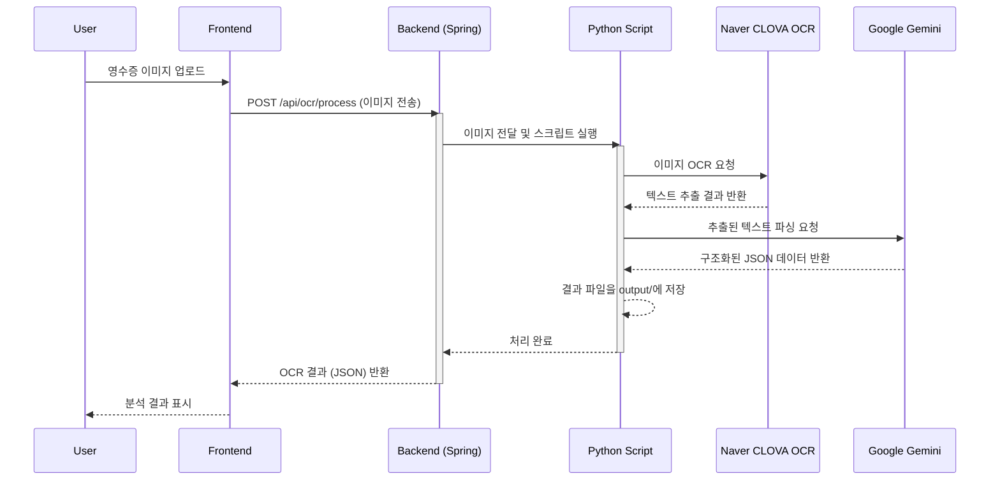

# FoodBuddy Frontend (푸드버디 프론트엔드)

FoodBuddy 프로젝트의 Next.js 기반 프론트엔드 웹 애플리케이션입니다. 사용자는 영수증 OCR을 통해 손쉽게 리뷰를 작성하고, 자신의 맛집 지도를 만들어갈 수 있습니다.

## ✨ 주요 기능 (Features)

- **사용자 인증**: JWT 기반 회원가입 및 로그인
- **영수증 OCR**: 영수증 사진을 업로드하여 식당, 메뉴, 가격 정보 자동 추출
- **AI 리뷰 생성**: OCR 정보와 사용자 평가(별점, 키워드)를 기반으로 OpenAI(GPT)가 리뷰 초안 자동 생성
- **통합 리뷰 작성**: OCR 정보, 식당 정보, 리뷰 내용을 한 번에 저장
- **맛집 지도**: 내가 리뷰한 식당들을 지도 위에 시각화하여 확인
- **리뷰 보관함**: 내가 작성한 모든 리뷰를 모아보고, 필터링 및 정렬하여 조회
- **사용자 설정**: 닉네임, 비밀번호, 리뷰 스타일 등 개인 정보 수정
- **반응형 UI**: 모바일 및 데스크탑 환경을 모두 지원하는 반응형 디자인

## 🚀 기술 스택 (Tech Stack)

- **Framework**: Next.js 14 (App Router)
- **Language**: TypeScript
- **Styling**: Tailwind CSS, shadcn/ui
- **State Management**: React Context API, React Query (TanStack Query)
- **API Communication**: Axios
- **Form Management**: React Hook Form
- **AI**:
  - **Review Generation**: OpenAI GPT-3.5-turbo
  - **Receipt OCR**: Naver CLOVA OCR
  - **OCR Data Parsing**: Google Gemini
- **Data Visualization**: Recharts
- **PWA**: Next-PWA
- **Icons**: Lucide React
- **Others**: Zod (Schema validation)

## 🏁 시작하기 (Getting Started)

이 프로젝트를 로컬 환경에서 실행하는 방법은 두 가지입니다.

### 1. 로컬 개발 환경 (Frontend Only)

프론트엔드 개발 서버만 실행하여 UI 및 기본 로직을 확인할 수 있습니다.

1.  **의존성 설치**

    ```bash
    pnpm install
    ```

2.  **환경 변수 설정**

    - `.env.local` 파일을 프로젝트 루트에 생성하고 아래 내용을 추가합니다.

    ```
    NEXT_PUBLIC_OPENAI_API_KEY=your_openai_api_key
    ```

3.  **개발 서버 실행**

    ```bash
    pnpm dev
    ```

4.  브라우저에서 `http://localhost:3000`으로 접속합니다.

### 2. Docker를 이용한 전체 스택 실행

Docker Compose를 사용하여 프론트엔드, 백엔드, 데이터베이스를 모두 포함한 전체 서비스를 실행합니다.

1.  **ECR 로그인 (최초 1회)**

    - AWS ECR에 저장된 이미지를 내려받기 위해 인증이 필요합니다.

    ```bash
    aws ecr get-login-password --region ap-northeast-2 | docker login --username AWS --password-stdin <your_aws_account_id>.dkr.ecr.ap-northeast-2.amazonaws.com
    ```

2.  **환경 변수 파일 생성**

    - 프로젝트 루트에 `.env` 파일을 생성하고 아래 내용을 채웁니다.

    ```
    ECR_REGISTRY=<your_aws_account_id>.dkr.ecr.ap-northeast-2.amazonaws.com
    ECR_REPOSITORY_FRONTEND=foodbuddy-frontend
    ECR_REPOSITORY_BACKEND=foodbuddy-backend
    IMAGE_TAG=latest # 또는 특정 이미지 태그
    ```

3.  **Docker Compose 실행**
    ```bash
    docker-compose up -d
    ```

## 🏗️ 아키텍처 및 인프라 (Architecture & Infrastructure)

본 프로젝트는 AWS(Amazon Web Services)를 기반으로 인프라를 구축하고, GitHub Actions를 통해 CI/CD 파이프라인을 자동화했습니다.

### 전체 시스템 아키텍처


### CI/CD 파이프라인 (`.github/workflows/deploy.yml`)

- **트리거**: `main`, `develop`, `infra/*` 브랜치에 `push` 이벤트가 발생하거나, `main`, `develop` 브랜치로 `pull_request`가 생성되면 파이프라인이 실행됩니다.
- **주요 Job**:
  1.  **`build-frontend` & `build-backend`**:
      - 프론트엔드와 백엔드 코드를 각각의 `Dockerfile`을 이용해 Docker 이미지로 빌드합니다.
      - 빌드된 이미지를 고유한 커밋 해시(`github.sha`)로 태깅하여 AWS ECR(Elastic Container Registry)에 푸시합니다.
  2.  **`deploy`**:
      - `build` 작업들이 모두 성공하면 실행됩니다.
      - `scp`를 사용하여 EC2 인스턴스에 최신 `docker-compose.yml` 파일을 전송합니다.
      - SSH로 EC2 인스턴스에 접속하여 컨테이너를 재배포하고 오래된 이미지를 정리합니다.

## 📂 프로젝트 구조 (Directory Structure)

```
foodreviewapp/
├── app/                  # 페이지 및 라우팅 (App Router)
│   ├── (main)/           # 메인 레이아웃 적용 페이지 그룹
│   │   ├── map/          # 지도 페이지
│   │   ├── storage/      # 리뷰 보관함 페이지
│   │   └── write/        # 리뷰 작성 페이지
│   ├── auth/             # 로그인/회원가입 페이지
│   ├── landing/          # 랜딩 페이지
│   ├── settings/         # 설정 페이지
│   └── api/              # 백엔드 API 프록시 (Route Handlers)
├── components/           # 재사용 UI 컴포넌트
│   ├── ui/               # shadcn/ui 컴포넌트
│   └── *.tsx             # 커스텀 모달, 네비게이션 등
├── contexts/             # 전역 상태 관리 (React Context)
├── hooks/                # 커스텀 훅
├── lib/                  # 공통 유틸리티 및 핵심 로직
│   ├── api.ts            # 백엔드 API 연동 함수
│   └── utils.ts          # 공통 헬퍼 함수
├── public/               # 정적 에셋 (이미지, 아이콘 등)
└── styles/               # 전역 스타일
```

## ⚙️ 핵심 로직 (Core Logic)

### API 연동

- **`lib/api.ts`** 파일에서 백엔드 서버와의 모든 통신을 관리합니다.
- `axios` 인스턴스를 생성하여 사용하며, 요청/응답 인터셉터를 통해 다음과 같은 기능을 수행합니다.
  - **요청 인터셉터**: `localStorage`에 저장된 JWT 액세스 토큰을 모든 요청의 `Authorization` 헤더에 자동으로 추가합니다.
  - **응답 인터셉터**: API 응답 상태 코드가 `401 Unauthorized`일 경우, 토큰이 만료된 것으로 간주하여 `localStorage`의 토큰을 삭제하고 로그인 페이지(`/auth`)로 리디렉션합니다.

### AI 리뷰 생성

- 사용자가 영수증 OCR을 통해 얻은 정보와 함께 별점, 원하는 말투(친근하게, 전문적으로 등), 추가 키워드를 입력하면 이를 조합하여 OpenAI API에 전송할 프롬프트를 생성합니다.
- **`lib/api.ts`의 `generateReview` 함수**가 이 로직을 담당하며, GPT-3.5-turbo 모델을 호출하여 자연스러운 리뷰 텍스트를 생성한 후 사용자에게 초안으로 제공합니다.

### 영수증 OCR 처리 흐름

영수증 인식 기능은 **Naver CLOVA OCR**로 텍스트를 추출하고, **Google Gemini**로 이를 분석/구조화하는 2단계 AI 프로세스로 구현됩니다.



1.  **이미지 업로드 (Frontend)**: 사용자가 영수증 이미지를 업로드합니다.
2.  **API 요청 (Frontend → Backend)**: 이미지를 백엔드의 `/api/ocr/process` 엔드포인트에 전송합니다.
3.  **Python 스크립트 실행 (Backend)**: 백엔드는 이미지를 서버에 저장하고 `ocr/ocr-parser.py` 스크립트를 실행합니다.
4.  **텍스트 추출 (Python → Naver CLOVA OCR)**: 스크립트가 Naver CLOVA OCR API를 호출하여 이미지에서 텍스트를 추출합니다.
5.  **데이터 파싱 (Python → Google Gemini)**: 추출된 순수 텍스트를 Google Gemini AI에 전달하여 가게 이름, 메뉴, 가격 등을 포함하는 구조화된 JSON 데이터로 파싱하도록 요청합니다.
6.  **결과 저장 및 반환 (Python → Backend → Frontend)**: Gemini가 생성한 JSON 결과를 파일로 저장한 뒤, 백엔드를 거쳐 프론트엔드로 최종 결과를 반환합니다.

### 상태 관리

- **React Context API** (`contexts/app-context.tsx`)를 사용하여 사용자 인증 정보(로그인 여부, 닉네임 등)를 전역적으로 관리합니다.
- 서버 상태(API 데이터)는 **React Query** (내부적으로 사용)를 통해 관리하여 데이터 캐싱, 재요청, 비동기 상태 처리를 효율적으로 수행합니다.
