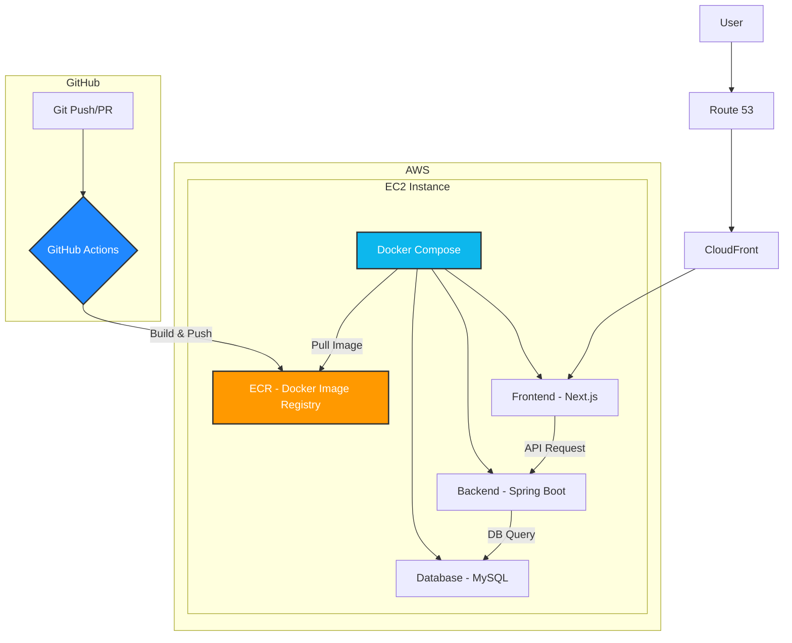
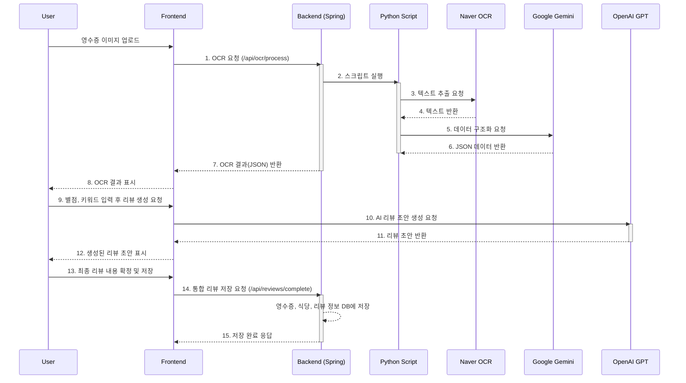

# 🍔 FoodBuddy (푸드버디)

> **영수증 OCR과 AI 리뷰 생성을 통해 나만의 맛집 지도를 완성하는 서비스**

FoodBuddy는 사용자가 영수증 사진 한 장으로 간편하게 방문 기록을 인증하고, AI의 도움을 받아 손쉽게 리뷰를 작성하며, 자신만의 맛집 지도를 만들어 나갈 수 있는 종합 음식 리뷰 플랫폼입니다.

## 🏛️ 기술 아키텍처 (Tech Architecture)

이 프로젝트는 Spring Boot 백엔드, Next.js 프론트엔드, 그리고 Docker 기반 인프라가 결합된 Monorepo 구조로 구성되어 있습니다.

### 전체 시스템 아키텍처



### 기술 스택 (Tech Stack)

| 구분               | 기술                                                                                                               |
| :----------------- | :----------------------------------------------------------------------------------------------------------------- |
| **Frontend**       | Next.js 14 (App Router), TypeScript, Tailwind CSS, shadcn/ui, React Query, Axios                                   |
| **Backend**        | Spring Boot 3, Java 17, Spring Security (JWT), JPA (Hibernate), Gradle                                             |
| **Database**       | MySQL 8.0                                                                                                          |
| **AI**             | **Naver CLOVA OCR** (영수증 텍스트 추출), **Google Gemini** (OCR 데이터 파싱), **OpenAI GPT-3.5** (리뷰 초안 생성) |
| **Infra & DevOps** | AWS (EC2, ECR, S3, Route 53, CloudFront), Docker, Docker Compose, GitHub Actions                                   |

## ✨ 주요 기능 (Features)

- **사용자 인증**: JWT 기반 회원가입 및 로그인
- **영수증 OCR**: 영수증 사진을 업로드하여 식당, 메뉴, 가격 정보 자동 추출
- **AI 리뷰 생성**: OCR 정보와 사용자 평가(별점, 키워드)를 기반으로 AI가 리뷰 초안 자동 생성
- **맛집 지도**: 내가 리뷰한 식당들을 지도 위에 시각화하여 확인
- **리뷰 보관함**: 내가 작성한 모든 리뷰를 모아보고, 필터링 및 정렬하여 조회
- **사용자 통계**: 나의 리뷰 활동에 대한 통계 정보 확인
- **즐겨찾기**: 관심 있는 식당을 즐겨찾기에 추가하고 관리

## 📂 프로젝트 구조 (Directory Structure)

```
FoodBuddy/
├── BE/yoriview/            # Spring Boot 백엔드 애플리케이션
│   ├── src/main/java         # Java 소스 코드
│   ├── build.gradle          # 백엔드 의존성 및 빌드 설정
│   └── Dockerfile            # 백엔드 Docker 이미지 빌드 설정
├── FE/foodreviewapp/       # Next.js 프론트엔드 애플리케이션
│   ├── app                   # 페이지 및 라우팅 (App Router)
│   ├── lib/api.ts            # API 통신 로직
│   ├── package.json          # 프론트엔드 의존성 설정
│   └── Dockerfile            # 프론트엔드 Docker 이미지 빌드 설정
├── Infra/                    # 인프라 관련 설정 (현재는 비어 있음)
├── .github/workflows/      # GitHub Actions CI/CD 워크플로우
└── docker-compose.yml      # 전체 서비스 실행을 위한 Docker Compose 설정
```

## 🏁 시작하기 (Getting Started)

Docker Compose를 사용하여 로컬 환경에서 전체 프로젝트를 실행할 수 있습니다.

1.  **ECR 로그인 (최초 1회)**

    - AWS ECR에 저장된 이미지를 내려받기 위해 인증이 필요합니다.

    ```bash
    aws ecr get-login-password --region ap-northeast-2 | docker login --username AWS --password-stdin <your_aws_account_id>.dkr.ecr.ap-northeast-2.amazonaws.com
    ```

2.  **환경 변수 파일 생성**

    - 프로젝트 루트에 `.env` 파일을 생성하고 아래 내용을 채웁니다.

    ```
    ECR_REGISTRY=<your_aws_account_id>.dkr.ecr.ap-northeast-2.amazonaws.com
    ECR_REPOSITORY_FRONTEND=foodbuddy-frontend
    ECR_REPOSITORY_BACKEND=foodbuddy-backend
    IMAGE_TAG=latest # 또는 특정 이미지 태그
    ```

3.  **Docker Compose 실행**
    ```bash
    docker-compose up -d
    ```
    - 프론트엔드: `http://localhost:3000`
    - 백엔드: `http://localhost:8080`

## 📖 API Endpoints

백엔드는 도메인 주도 설계(DDD)를 기반으로 API가 구성되어 있습니다.

| 도메인         | Method | URL                     | 설명                           |
| :------------- | :----- | :---------------------- | :----------------------------- |
| **User**       | POST   | `/api/users/register`   | 회원가입                       |
|                | POST   | `/api/users/login`      | 로그인                         |
|                | GET    | `/api/users/me`         | 내 정보 조회                   |
| **OCR**        | POST   | `/api/ocr/process`      | 영수증 이미지 처리             |
| **Review**     | POST   | `/api/reviews`          | 리뷰 작성                      |
|                | POST   | `/api/reviews/complete` | 통합 리뷰 저장 (OCR+식당+리뷰) |
|                | GET    | `/api/reviews/me`       | 내 리뷰 목록 조회              |
| **Restaurant** | GET    | `/api/restaurants`      | 모든 식당 조회                 |
| **Favorite**   | POST   | `/api/favorites/{id}`   | 즐겨찾기 추가/삭제             |
| **Statistics** | GET    | `/api/statistics/me`    | 내 통계 조회                   |
| **Visit**      | POST   | `/api/visits/{id}`      | 방문 기록 추가                 |

## ⚙️ 핵심 로직: 영수증 처리 및 AI 리뷰 생성 흐름



## 🚀 CI/CD (지속적 통합 및 배포)

- **소스코드**: GitHub
- **CI/CD 도구**: GitHub Actions (`.github/workflows/deploy.yml`)
- **배포 파이프라인**:
  1.  `main` 또는 `develop` 브랜치에 코드가 Push 되거나 Pull Request가 생성되면 워크플로우가 실행됩니다.
  2.  프론트엔드와 백엔드 코드를 각각 Docker 이미지로 빌드합니다.
  3.  빌드된 이미지를 AWS ECR(Elastic Container Registry)에 푸시합니다.
  4.  AWS EC2 인스턴스에 SSH로 접속하여 최신 이미지를 `docker-compose pull`로 받아온 뒤, 서비스를 재시작하여 배포를 완료합니다.
