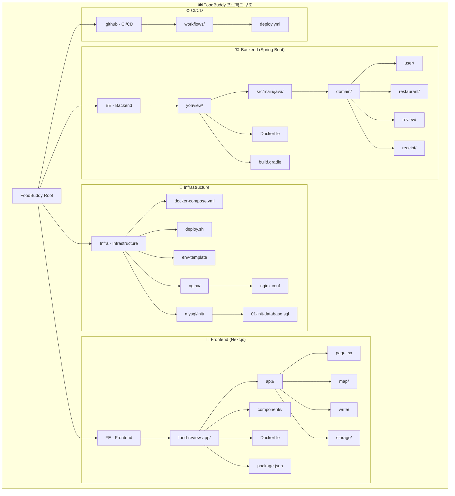
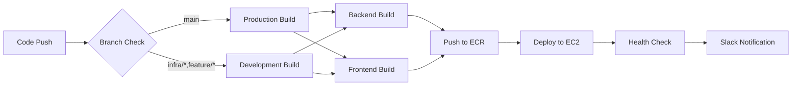
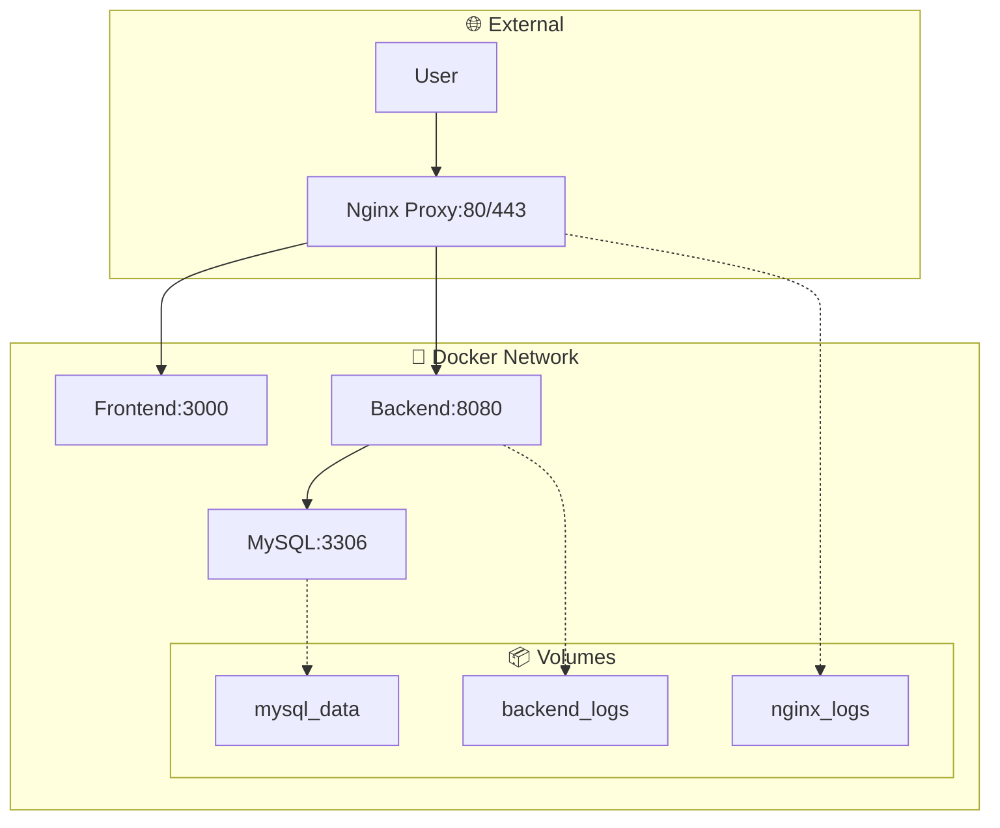

# 🍽️ FoodBuddy 코드베이스 구조 가이드

이 문서는 FoodBuddy 프로젝트의 전체 구조를 한눈에 파악할 수 있도록 작성되었습니다.

## 📊 프로젝트 전체 구조 다이어그램



## 📁 디렉토리 구조 상세 설명

### 🏗️ BE/ - 백엔드 (Spring Boot)

```
BE/
└── yoriview/                    # Spring Boot 애플리케이션 루트
    ├── src/main/java/com/vibe/yoriview/
    │   ├── domain/              # 도메인 계층
    │   │   ├── user/           # 👤 사용자 도메인
    │   │   │   ├── User.java
    │   │   │   ├── UserController.java
    │   │   │   ├── UserService.java
    │   │   │   ├── UserRepository.java
    │   │   │   └── dto/        # 데이터 전송 객체
    │   │   ├── restaurant/     # 🍽️ 음식점 도메인
    │   │   │   ├── Restaurant.java
    │   │   │   ├── RestaurantController.java
    │   │   │   ├── RestaurantService.java
    │   │   │   ├── RestaurantRepository.java
    │   │   │   ├── Location.java
    │   │   │   ├── LocationRepository.java
    │   │   │   └── dto/
    │   │   ├── review/         # 📝 리뷰 도메인
    │   │   │   ├── Review.java
    │   │   │   ├── ReviewController.java
    │   │   │   ├── ReviewService.java
    │   │   │   ├── ReviewRepository.java
    │   │   │   ├── ReviewStyle.java
    │   │   │   ├── ReviewStyleController.java
    │   │   │   ├── ReviewStyleService.java
    │   │   │   ├── ReviewStyleRepository.java
    │   │   │   └── dto/
    │   │   └── receipt/        # 📋 영수증 도메인
    │   │       ├── Receipt.java
    │   │       ├── ReceiptController.java
    │   │       ├── ReceiptService.java
    │   │       ├── ReceiptRepository.java
    │   │       ├── ReceiptItem.java
    │   │       ├── ReceiptItemRepository.java
    │   │       └── dto/
    │   ├── global/             # 🌍 전역 설정
    │   │   ├── config/         # 설정 클래스
    │   │   │   ├── SecurityConfig.java
    │   │   │   ├── JwtTokenProvider.java
    │   │   │   └── JwtAuthenticationFilter.java
    │   │   └── exception/      # 예외 처리
    │   │       ├── GlobalExceptionHandler.java
    │   │       ├── EmailAlreadyExistsException.java
    │   │       └── InvalidCredentialsException.java
    │   └── YoriviewApplication.java  # 🚀 메인 애플리케이션
    ├── src/main/resources/
    │   └── application.properties    # ⚙️ 애플리케이션 설정
    ├── src/test/                    # 🧪 테스트 코드
    ├── Dockerfile                   # 🐳 백엔드 Docker 이미지
    ├── build.gradle                 # 📦 빌드 설정
    ├── gradlew                      # Gradle Wrapper
    └── settings.gradle              # Gradle 프로젝트 설정
```

**주요 특징:**

- **도메인 주도 설계(DDD)** 패턴 적용
- **JWT 기반 인증/인가** 시스템
- **JPA/Hibernate** ORM 사용
- **MySQL 8.0** 데이터베이스 연동
- **멀티스테이지 Docker** 빌드로 최적화

### 🎨 FE/ - 프론트엔드 (Next.js)

```
FE/
└── food-review-app/             # Next.js 애플리케이션 루트
    ├── app/                     # App Router (Next.js 13+)
    │   ├── page.tsx            # 🏠 홈페이지
    │   ├── layout.tsx          # 📱 공통 레이아웃
    │   ├── globals.css         # 🎨 전역 스타일
    │   ├── landing/            # 🌟 랜딩 페이지
    │   ├── map/                # 🗺️ 지도 페이지
    │   ├── write/              # ✍️ 리뷰 작성
    │   ├── storage/            # 💾 보관함
    │   ├── settings/           # ⚙️ 설정
    │   └── api/                # 🔗 API 라우트
    │       ├── ocr/
    │       ├── restaurant/
    │       └── review/
    ├── components/             # 🧩 재사용 컴포넌트
    │   ├── ui/                 # UI 기본 컴포넌트 (Radix UI)
    │   ├── navigation.tsx      # 네비게이션
    │   ├── restaurant-detail-modal.tsx
    │   ├── review-detail-modal.tsx
    │   ├── share-modal.tsx
    │   ├── statistics-tab.tsx
    │   └── theme-provider.tsx
    ├── hooks/                  # 🪝 커스텀 훅
    ├── lib/                    # 📚 유틸리티
    ├── styles/                 # 🎨 스타일 파일
    ├── public/                 # 🌍 정적 파일
    ├── Dockerfile              # 🐳 프론트엔드 Docker 이미지
    ├── package.json            # 📦 패키지 설정
    ├── next.config.mjs         # ⚙️ Next.js 설정
    ├── tailwind.config.ts      # 🎨 Tailwind CSS 설정
    └── tsconfig.json           # 📝 TypeScript 설정
```

**주요 특징:**

- **Next.js 14** with App Router
- **TypeScript** 타입 안정성
- **Tailwind CSS** 유틸리티 스타일링
- **Radix UI** 접근성 있는 컴포넌트
- **Standalone 빌드** 최적화

### 🚀 Infra/ - 인프라 및 배포

```
Infra/
├── docker-compose.yml          # 🐳 서비스 오케스트레이션
├── deploy.sh                   # 🚀 배포 자동화 스크립트
├── env-template                # 📝 환경변수 템플릿
├── nginx/                      # 🌐 리버스 프록시
│   └── nginx.conf             # Nginx 설정
└── mysql/                      # 🗄️ 데이터베이스
    └── init/                   # 초기화 스크립트
        └── 01-init-database.sql
```

**주요 특징:**

- **Docker Compose** 멀티 서비스 관리
- **Nginx** 리버스 프록시 & 로드 밸런싱
- **MySQL 8.0** 컨테이너화된 데이터베이스
- **자동화된 배포** 스크립트
- **환경별 설정** 분리

### ⚙️ .github/ - CI/CD 자동화

```
.github/
└── workflows/
    └── deploy.yml              # 🔄 GitHub Actions 워크플로우
```

**주요 특징:**

- **변경 감지** 기반 조건부 빌드
- **병렬 처리** 백엔드/프론트엔드 동시 빌드
- **ECR 이미지** 자동 푸시
- **EC2 자동 배포** 및 헬스체크
- **환경별 배포** (prod/dev)

## 🔄 CI/CD 파이프라인 플로우



## 🐳 Docker 서비스 아키텍처



## 📚 주요 기술 스택

### 백엔드

- **Java 17** - 최신 LTS 버전
- **Spring Boot 3.5.3** - 웹 프레임워크
- **Spring Security** - 보안 및 인증
- **JPA/Hibernate** - ORM
- **MySQL 8.0** - 관계형 데이터베이스
- **JWT** - 토큰 기반 인증

### 프론트엔드

- **Next.js 14** - React 풀스택 프레임워크
- **TypeScript** - 타입 안전성
- **Tailwind CSS** - 유틸리티 퍼스트 CSS
- **Radix UI** - 접근성 있는 UI 컴포넌트
- **React Hook Form** - 폼 관리

### 인프라 & DevOps

- **Docker** - 컨테이너화
- **Docker Compose** - 멀티 컨테이너 오케스트레이션
- **AWS ECR** - 컨테이너 레지스트리
- **AWS EC2** - 클라우드 컴퓨팅
- **Nginx** - 웹 서버 & 리버스 프록시
- **GitHub Actions** - CI/CD 파이프라인

## 🎯 성능 최적화 포인트

### 빌드 최적화

- **멀티스테이지 Docker** 빌드
- **캐시 활용** (Gradle, npm, Docker layers)
- **병렬 빌드** 처리
- **조건부 실행** (변경된 파일만)

### 런타임 최적화

- **JVM 튜닝** (G1GC, 메모리 설정)
- **Next.js Standalone** 빌드
- **Nginx 압축** 및 캐싱
- **데이터베이스 인덱싱**

## 🛡️ 보안 설정

### 애플리케이션 보안

- **JWT 토큰** 기반 인증
- **HTTPS** 강제 리다이렉트
- **CORS** 설정
- **XSS/CSRF** 방어 헤더

### 인프라 보안

- **Non-root 사용자** 컨테이너 실행
- **환경변수** 암호화 관리
- **네트워크 격리** (Docker 네트워크)
- **접근 제어** (방화벽 설정)

## 📊 모니터링 & 로깅

### 헬스체크 엔드포인트

- **Backend**: `/actuator/health`
- **Frontend**: `/`
- **Nginx**: `/health`

### 로그 관리

- **Backend**: Spring Boot 로깅
- **Frontend**: Next.js 로깅
- **Nginx**: 액세스/에러 로그
- **Database**: MySQL 슬로우 쿼리 로그

## 🔧 개발 환경 설정 가이드

### 로컬 개발

1. **환경변수 설정**: `cp Infra/env-template .env`
2. **Docker 실행**: `cd Infra && docker-compose up -d`
3. **서비스 확인**: http://localhost:3000

### 배포 환경

1. **GitHub Secrets** 설정
2. **브랜치 푸시**: `git push origin main`
3. **자동 배포** 확인

---

## 🤝 팀 개발 가이드

### Git 브랜치 전략

- **main**: 프로덕션 코드
- **infra/\***: 인프라 관련 작업
- **feature/\***: 새로운 기능 개발
- **bugfix/\***: 버그 수정

### 코드 리뷰 체크리스트

- [ ] 코드 품질 (ESLint, SonarQube)
- [ ] 테스트 커버리지
- [ ] 보안 취약점 점검
- [ ] 성능 영향 분석
- [ ] 문서 업데이트

이 문서는 프로젝트 진행에 따라 지속적으로 업데이트됩니다. 📝
